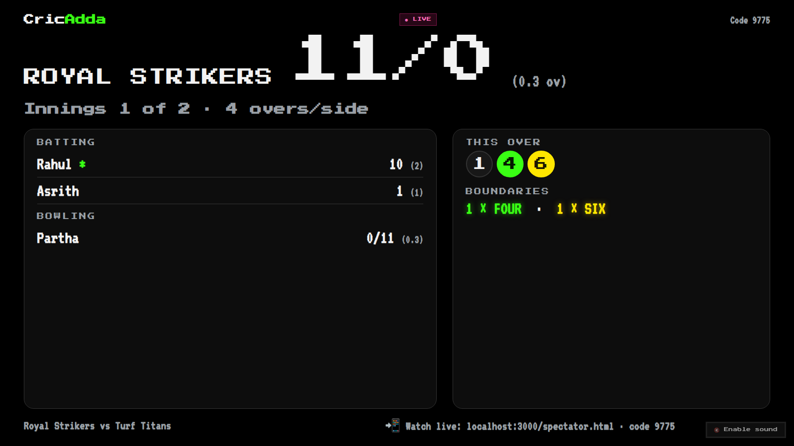
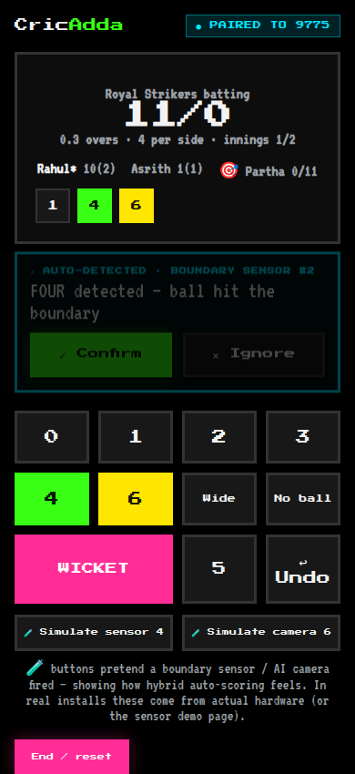
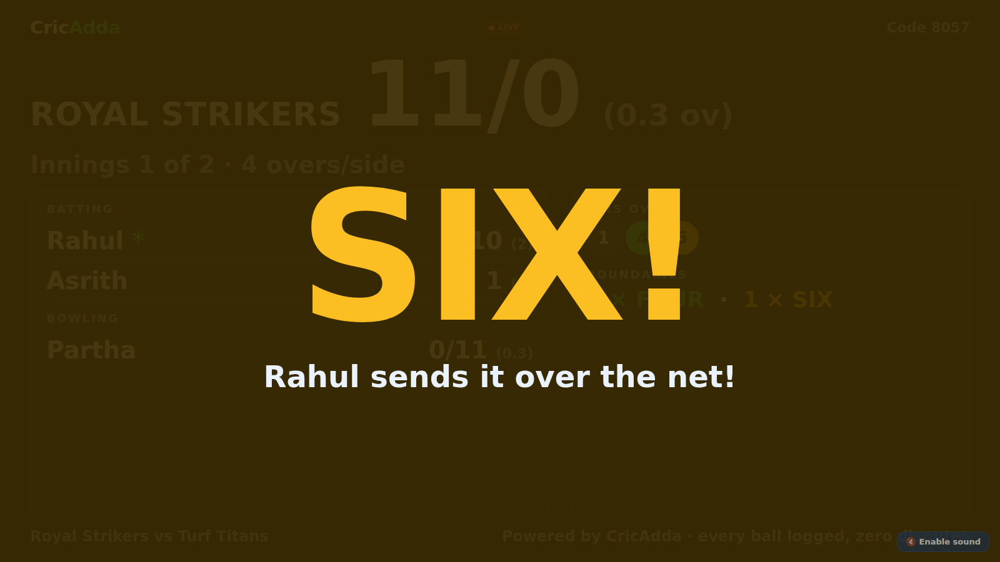
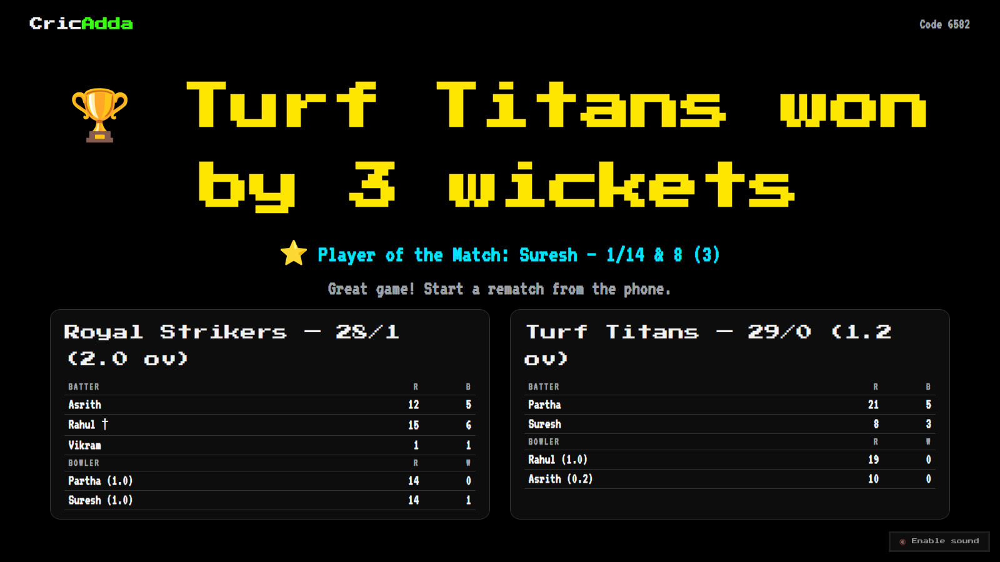

# CricAdda — Smart Cricket Turf Scoring & Experience Platform

**Turn any box-cricket turf into a stadium.**

CricAdda is a connected scoring and match-experience system for cricket turfs. A big LED
screen behind the batsman shows live scores, player names, animations and replays — all
controlled from a phone. Players log in with their phone number, create teams, pair with
the turf screen using a simple code, and score matches manually or automatically using
boundary sensors and AI cameras.

## 🚀 The Client Website + Working Demo — Run It Now

One website carries the entire pitch **and** the live demo. Zero dependencies, just Node.js:

```bash
node prototype/server.js
```

Open `http://localhost:3000` → a retro-arcade landing page (pixel fonts, CRT scanlines,
self-playing "attract mode" scoreboard) that walks a client through everything top to
bottom: the story, the player journey level-by-level, how the system connects, real
screenshots, the live demo launchers, features, and the full process from first call
to a fully-equipped stadium turf.

Demo pages (linked from the site):
1. **Big screen** (laptop/TV): open `http://localhost:3000/screen.html` → shows a 4-digit pairing code
2. **Phone** (same Wi-Fi): open `http://<your-ip>:3000` (printed by the server) → Phone Controller → enter the code
3. **Sensor demo**: open `/sensor.html` anywhere to simulate the boundary sensor / AI camera firing
4. **Spectator view**: open `/spectator.html` on any device — friends follow ball-by-ball live with full scorecards, no login

| Big screen | Phone controller |
|---|---|
|  |  |





The demo proves the whole core loop: **pair with a code → phone controls the screen →
live scoring with celebrations → sensor auto-detection with one-tap confirm → full match
to a result with scorecards and Player of the Match, plus undo, rematch, and a no-login
spectator view.** The engine is event-sourced (every ball is a logged event) — the same
architecture the production system uses.

## 🕹️ The App — Complete Model (web-first)

[`website/app/`](website/app/) is the **complete product model as a web app** — the app
we'll wrap for the Play Store later, built web-first. Live at `/app/` on the hosted site:

- **Onboarding like a game**: made. splash → phone number → OTP (arriving as an on-screen
  SMS) → arcade **character-select with retro pixel avatars** (procedurally generated,
  infinite variations) → "Ready Player One" card
- **Player card**: avatar, arcade title ("Six Machine", "Gully Gladiator"…), XP bar,
  levels, career numbers
- **Real matches** on the same event-sourced engine — every run and wicket credits your
  lifetime career, with full-screen FOUR!/SIX!/OUT! celebrations and sounds
- **Career & badges**: batting/bowling stats, match history, unlockable badges
  (BIG HITTER, 50 CLUB, WICKET WOLF…), Player-of-the-Match count
- **Squads**: build teams once, reuse forever
- Everything persists in the browser (localStorage) — no backend needed for the model;
  the cloud layer from [docs/03](docs/03-system-architecture.md) slots in behind it later

## 🌐 Hosted Client Website (Vercel-ready)

[`website/`](website/) is a pure-static copy of the pitch site with a **playable
in-browser demo** (screen + phone side by side, engine runs client-side — no server
needed). Deploy it to your domain in minutes: import the repo on Vercel and set the
Root Directory to `website`. Full instructions in [`website/README.md`](website/README.md).

## Documentation

| Doc | What it covers |
|---|---|
| [00 — Beginner Guide](docs/00-beginner-guide.md) | **Start here** — plain-words walkthrough with screenshots |
| [01 — Project Overview](docs/01-project-overview.md) | Vision, concept, how it works end-to-end |
| [02 — Feature Catalog](docs/02-features.md) | Every feature: core, automation, and "wow" ideas |
| [03 — System Architecture](docs/03-system-architecture.md) | App, screen, backend, sensors/cameras, sync |
| [04 — Roadmap & Phases](docs/04-roadmap.md) | MVP → full automation, phased delivery plan |
| [05 — Case Study](docs/05-case-study.md) | Problem, solution, pilot scenario, expected outcomes |
| [06 — Client Proposal](docs/06-client-proposal.md) | Shareable pitch document for clients / turf owners |
| [07 — Hardware & Sync](docs/07-hardware-and-sync.md) | **Making it real**: the screen, ball protection, hub, sensors, cameras, networking, sync, costs, install checklist |

## The Core Idea in 30 Seconds

1. **Big screen on the turf** — placed behind the batsman (sight-screen position) and/or
   facing the batsman, showing live score, batsman/bowler names, overs, and animations.
2. **Phone-first control** — players sign in with phone number + OTP, create/save teams,
   and control everything from their phone.
3. **Simple pairing** — the screen displays a short code; enter it in the app and your
   phone becomes the remote for the whole turf.
4. **Manual + automatic scoring** — score ball-by-ball from the phone, or let boundary
   sensors and AI cameras auto-detect 4s, 6s and runs. Manual override always wins.
5. **Match experience** — replays, celebration animations, player stats, leaderboards,
   tournaments, and auto-generated highlights shared after the match.

---

*CricAdda — a **made.** product · made. by ac*
