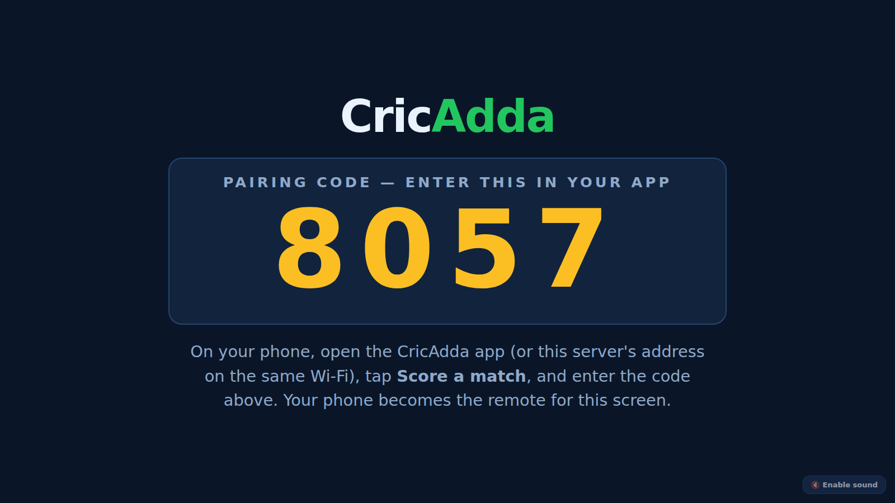
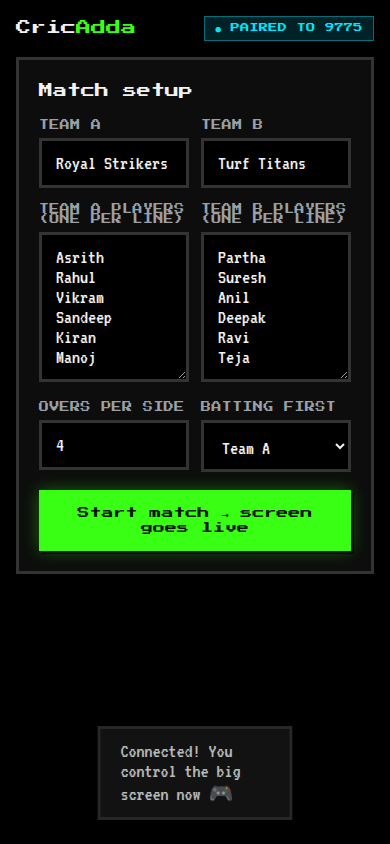
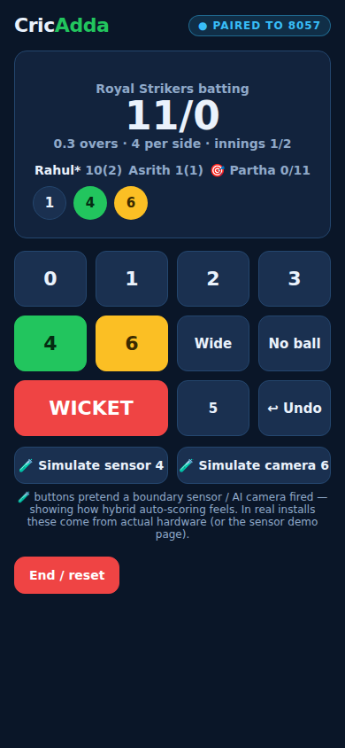
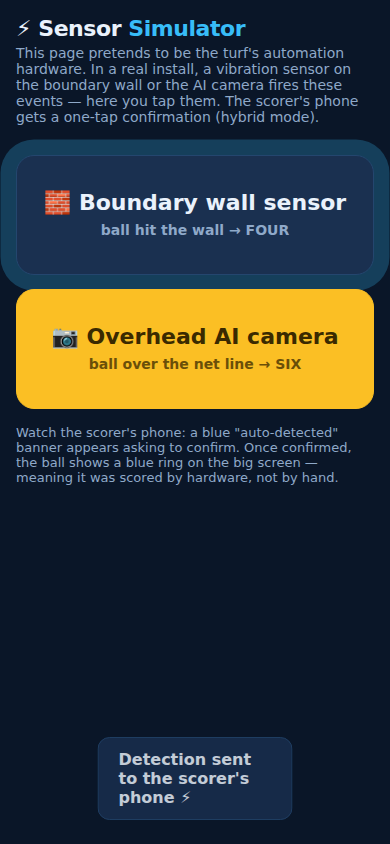
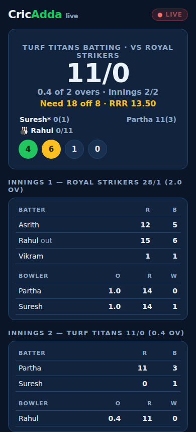

# 🏏 CricAdda for Beginners — What Is This, In Plain Words?

*No tech knowledge needed. Pictures below are real screenshots from the working demo in
this repo.*

---

## The Idea in One Line

> **A big TV screen at the cricket turf shows the live score like a real stadium — and
> your phone is the remote control.**

## How It Works, Step by Step

### Step 1 — The big screen shows a code

At the turf, a large screen (behind the bowler, facing the batsman) sits waiting with a
4-digit code:



### Step 2 — Pair your phone & set up the match

Open the app on your phone, type that code — done, your phone now controls the screen.
Enter your team names and players (teams you save once can be reused every week):



### Step 3 — Score from your phone, everyone watches the screen

Tap the runs on your phone after each ball. The big screen updates instantly — score,
batsmen, bowler, this over, boundaries:




### Step 4 — Hit a six, the turf goes crazy 🎉

Fours and sixes trigger full-screen celebrations with stadium sounds. Fifties get the
player's name in lights:


### Step 5 — The magic: automatic detection ⚡

Small sensors on the boundary walls and AI cameras above the turf can **detect fours,
sixes and runs by themselves**. When they do, the scorer's phone shows a blue banner —
one tap to confirm:




> **Important:** the human is always the boss. Anything the sensors get wrong can be
> fixed in two taps. Manual scoring works perfectly with zero hardware — sensors just
> make it faster and cooler.

### Step 6 — Friends watch live, and the match ends like TV 👀🏆

Anyone — a parent at home, a friend at work — can open the **spectator page**, type the
match code, and follow ball-by-ball live with full scorecards. No app, no login. And when
the match ends, the big screen shows the result, both scorecards, and an automatically
chosen **Player of the Match**:




## Try It Yourself (2 minutes)

You only need [Node.js](https://nodejs.org) installed. Then:

```bash
node prototype/server.js
```

1. Open **http://localhost:3000/screen.html** on your laptop/TV → the big screen appears with a code.
2. On your phone (same Wi-Fi), open **http://YOUR-LAPTOP-IP:3000** (the server prints it) → tap **Phone Controller** → enter the code.
3. Score away. Open **/sensor.html** anywhere to play with auto-detection.

*(No phone handy? Open all three pages in separate browser tabs on one computer — it
works exactly the same.)*

## Words You'll See, Explained

| Word | Meaning |
|---|---|
| **Pairing code** | The 4-digit number on the screen — typing it into your phone connects the two |
| **Turf Hub** | The small computer box at the turf that runs the screen and talks to sensors |
| **Hybrid scoring** | Sensors suggest, human confirms — the best of both |
| **Event log** | Every ball is saved with who scored it and when — so scores can never be disputed |
| **OTP login** | Sign in with your phone number and the code you get by SMS — no passwords |

## What's a Prototype vs. the Real Thing?

| This demo (in the repo) | The real product |
|---|---|
| Web pages on a laptop + phone | Real outdoor LED screen + mobile app |
| A button that *pretends* to be a sensor | Actual vibration sensors + AI cameras |
| One match in memory | Cloud accounts, saved teams, career stats, tournaments, highlights |

The demo proves the core experience: **pair with a code → phone controls the screen →
score live → sensors assist**. Everything else is layers on top — see the
[feature catalog](02-features.md) and [roadmap](04-roadmap.md).

---

*CricAdda — a **made.** product · made. by ac*
